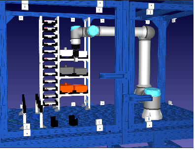

# Digital Twin System for Automated Robotic Battery Assembly

<p align="center">
  
</p>

---

## 📊 Project Overview

[](rua.pdf)
[](https://www.python.org/)
[](https://www.riverbankcomputing.com/software/pyqt/)
[](https://robodk.com/)
[](https://www.universal-robots.com/)

This repository contains the necessary files to configure, deploy, and execute the developed **Digital Twin System** for automated robotic battery module assembly and disassembly. Developed as a Bachelor's Thesis project, this framework demonstrates the feasibility and advantages of combining digital twins with industrial systems to enhance human-robot collaboration, optimal safety control, and process optimization.

The system features a custom-built Graphical User Interface (GUI) that enables bidirectional, real-time synchronization with a physical **UR10e robotic arm** and a **RobotiQ 2F-85 gripper**, supporting both manual adjustments and end-to-end automated sequencing integrated with computer vision tracking.

---

## 🎬 Visual Demonstration


---

## 🛠️ Technical Specifications & Prerequisites

To ensure seamless communication between the virtual and physical station, verify that the environment meets the following baseline requirements:

### 💻 Software Stack
* **Python** `v3.10.0`
* **RoboDK** `v5.9.0` (A valid/active license is strictly required; the free/deactivated tier cannot load the complete station/cell due to object limit constraints).
* **Polyscope (UR)** `v5.20.0.0`
* **Visual Studio Code** `v1.85.0+` (Recommended IDE).

### 🔌 Network & Hardware Environment
1. The physical UR10e robot must be set to **Remote Control Mode** via its Teach Pendant.
2. Establish a local area network connection by connecting the robot controller via an Ethernet cable to the local gateway router.
3. Configure your local PC's Firewall to permit traffic through the `apiur` driver, opening **ports 30000–30002** (the native channels RoboDK uses to communicate with Universal Robots).
4. In the RoboDK "Connect to Robot" panel, input the correct designated IP address for the controller and target **port 30002**.

---

## 📁 Code Architecture & Components

The main module `ui.py` relies heavily on internal references. **Do not change any file or asset names** inside this directory, or the UI mapping will fail.

<details>
<summary>📦 <b>Click here to expand the detailed file breakdown</b></summary>

### Core Executables:
* **`ui.py`**: The primary entry point. It initializes the `RobotControlUI` instance. Built using multithreading mechanisms to prevent interface freezing during asynchronous joint motions. Run this through the VS Code terminal to access full automated and manual control panels.
* **`robotcode.py`**: Developed in collaboration with Paula Bolívar Pérez and Aitor Sagarna Zabala. Contains pre-calculated mathematical paths and the `Vision` class handling USB camera inputs to detect cells, lids, and boxes. Can be executed independently for a quick, terminal-based automated run (lacks manual jogging controls and user interface).
* **`gripper.py`**: Abstracts the underlying command logic (`Gripper`) managing both the virtual end-effector inside RoboDK and raw socket messaging for the physical tool.

### Buffers, Configuration, and Models:
* **`robotic_station.rdk`**: The full-scale digital twin cell model designed and assembled natively inside RoboDK and Rhinoceros 3D.
* **`reset_station.png`**: Visual anchor reference mapping the initial empty cell state, rendered dynamically within the GUI layout.
* **`joints.csv` / `joint_usage_history.csv`**: Temporal telemetry data buffers managed automatically by the analytical `Maintenance` class. They record positions, velocities, and acceleration limits to monitor stress metrics. These files can be safely deleted; the UI automatically builds fresh instances if they are missing.
* **`.urp` and `.script` files**: Automated script injections pushed directly over open network sockets to command the gripper state machine on the UR10e.

</details>

---

## 🚀 Quick Start Guide

1. Power on the robot controller and switch the pendant to **Remote Control**.
2. Launch RoboDK and load the `robotic_station.rdk` project.
3. Ensure the UR10e robot node within the RoboDK station tree is assigned the **"Universal Robots RobotiQ"** post-processor.
4. Install all Python dependencies (`PyQt6`, `casadi`, `opencv-python`, `robolink`, etc.).
5. Open the workspace root directory in VS Code and run:
   ```bash
   python ui.py


This system has been developed for a thesis project in collaboration with Selene Delgado Pastor.

Use of this code or structure is encouraged, with the right considerations stated below. Reading the thesis before expanding on these files is recomended. Any additional work or use of the results, virtual model or code must make reference to at least one of the authors.

The software developed and presented within this thesis has been tested and validated exclusively within the defined scope and under the specific conditions described throughout the project in the controlled laboratory conditions at the University of Skövde / ASSAR Innovation Arena. Any modification of the source code, execution outside the recommended hardware or software environment, or use beyond the scenarios and safety assumptions established in the thesis falls entirely outside the intended design. Therefore, the authors do not assume any responsibility or liability for potential malfunctions, unintended behaviors, or damages resulting from such uses or ocurring outside the authors' supervision. The use of the software developed must be executed with constant supervision of a trained individual. It is the responsibility of any third party using this code to ensure proper validation and risk assessment before deployment.


